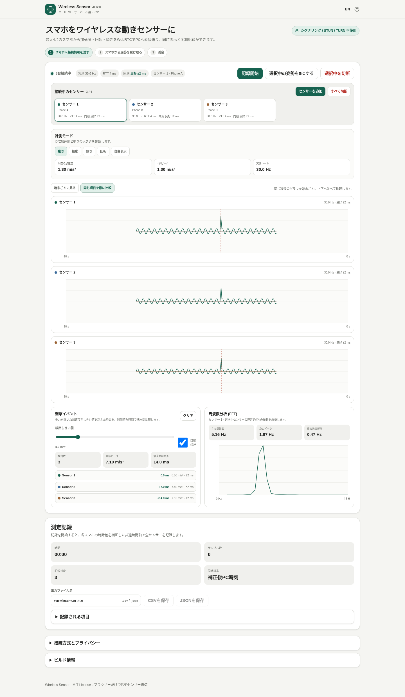

# Wireless Sensor

[](https://github.com/ttomohisa/htmlapps-wireless-sensor/actions/workflows/deploy-pages.yml)
[](LICENSE)
[](https://ttomohisa.github.io/htmlapps-wireless-sensor/)

[English README](README.md)

最大4台のスマートフォンをワイヤレスな動きセンサーとしてPCへ同時接続し、加速度・回転・傾きをWebRTCで直接送信して同期記録します。衝撃の到達時間差、FFTによる振動周波数分析、同一信号の縦並び比較までブラウザーだけで行える、プライバシー重視の Browser Kitty 単一HTMLツールです。

## 🚀 デモ

### [GitHub PagesでWireless Sensorを開く](https://ttomohisa.github.io/htmlapps-wireless-sensor/)

PC / タブレットとスマートフォンの両方で同じページを開いて使います。GitHub Pagesが配信するのは最初のHTMLだけです。WebRTCの接続情報はQRまたはコピー＆ペーストで端末間を直接受け渡しし、センサー値もP2Pで送信します。シグナリング、STUN、TURNサーバーは使いません。

[](https://ttomohisa.github.io/htmlapps-wireless-sensor/)

## 主な機能

- **最大4台のスマホを同時計測** — 受信PCはスマホごとに独立したWebRTC接続を持ち、1台が切れても他の接続を継続します。
- **スマホをワイヤレスな動きセンサーに** — 加速度、重力込み加速度、回転速度、端末の向きをブラウザーから取得します。
- **シグナリングサーバーなしで接続** — WebRTCは `iceServers: []` で作成し、Offer / Answerを端末間で直接受け渡します。
- **両方向ともカメラQRが基本** — PCの分割Offer QRをスマホで読み、続いてスマホの分割Answer QRをPCカメラで読み取ります。
- **普通のカメラで読みやすいQR** — 接続情報を低密度な複数QRへ分割。スマホは背面カメラを優先し、PCではネイティブQR読み取りが使えない場合に内包済み `jsQR` へ自動フォールバックします。
- **個別・重ね合わせ・縦並び比較** — センサーを1台ずつ選ぶ従来表示と全センサー重ね合わせに加え、加速度など同じ信号を端末ごとのグラフとして上下に並べ、波形の違いを直接比較できます。
- **時計差を補正して同期記録** — 接続直後と定期的なPing/Pongから各スマホとPCの時計差・ドリフトを推定し、低RTTのサンプルを優先して共通時間軸へ補正します。同期精度の目安も端末ごとに表示します。
- **用途に合わせた計測モード** — **動き / 振動 / 傾き / 回転 / 自由表示** を切り替えられます。振動では直近2秒のRMS・ピーク・振動幅、回転では合成回転速度などを表示します。
- **衝撃イベントと端末間時間差** — 重力を除いた加速度がしきい値を超えた瞬間を自動検出し、時計同期後の時刻で同じ衝撃を端末間グループ化。最初の端末から何ms後に他端末へ届いたかを表示します。
- **FFT周波数分析** — 選択中端末の直近約4秒をローカル解析し、主な周波数・次のピーク・周波数分解能を表示します。X/Y/Zのうち変動が最も大きい軸を自動選択して解析します。
- **単一HTML・日英UI** — QR関連ライブラリはビルド時にHTMLへ内包し、日本語 / 英語を同じHTMLで切り替えられます。

## すぐに使う

### Webで使う

1. 両方の端末で [Wireless Sensor](https://ttomohisa.github.io/htmlapps-wireless-sensor/) を開きます。
2. PCとスマホを同じWi-Fi / LANへ接続します。
3. PC / タブレットで **この端末で測定を見る** → **接続情報を作る** を押します。
4. スマホで **このスマホをセンサーにする** → **PCのQRをカメラで読む** を押し、PCに表示されたQRを読み取ります。
5. スマホに返答QRが表示されたら、PC側の **スマホの返答QRをカメラで読む** を押し、スマホ画面をPCカメラへ向けます。
6. WebRTC接続後、スマホで **センサーを開始** を押し、必要なセンサー権限を許可します。
7. さらにスマホを追加する場合は、PC側の **センサーを追加** を押して同じQR接続を繰り返します。最大4台まで同時接続できます。

インストールやアカウント登録は不要です。スマホのカメラ・モーションセンサー権限のため、HTTPSで公開したページからの利用を推奨します。

### 単一HTMLをビルドして使う

1. このリポジトリをダウンロードまたはクローンします。
2. Windows 10 / 11で `build-standalone.bat` をダブルクリックします。
3. 初回のみ、`dependencies.json` で固定された依存パッケージを取得します。
4. 生成された `dist/index.html` を開くか、任意の場所へコピーします。

Python、Node.js、ローカルWebサーバーは不要です。Windows標準のPowerShellと `tar.exe` を使用します。

## 使い方

### 受信側: PC / タブレット

1. **この端末で測定を見る** を選びます。
2. **接続情報を作る** を押します。分割QRが表示され、自動で切り替わります。
3. スマホ側でOffer QRをすべて読み取ります。読み取り順は問いません。
4. **スマホの返答QRをカメラで読む** を押し、スマホ画面をPCカメラへ向けます。
5. 返答QRがすべて揃うとAnswerを自動で復元し、接続完了を待ちます。
6. 追加する場合は **センサーを追加** から同じ手順を繰り返します。既存センサーは接続したままです。
7. 接続中のセンサーカードを選ぶと、その端末の現在値・3D表示・実測レート・RTTを確認できます。
8. **計測モード** から **動き / 振動 / 傾き / 回転 / 自由表示** を選びます。モードに応じてグラフと要約指標が切り替わります。
9. 表示方法は **端末ごとに見る** / **同じ項目を縦に比較** を切り替えられます。端末ごと表示ではグラフを **選択中** / **全センサー重ね合わせ** から選び、縦並び比較では同じ加速度・振動・傾き・回転信号をスマホごとのグラフとして上下に並べます。
10. **衝撃イベント** では検出しきい値を調整できます。同じ衝撃として検出された複数端末の到達時刻差と同期誤差の目安を表示します。
11. **周波数分析 (FFT)** では選択中端末の直近約4秒から主周波数などを表示します。
12. **選択中の姿勢を0にする** は端末ごとに独立して適用されます。
13. 接続直後に時計同期を自動調整し、その後も定期的に再同期します。ヘッダーとセンサーカードの **同期** 表示で推定誤差を確認できます。
14. 記録を開始すると、補正済みの共通時間軸で全センサーを記録します。JSONには記録中に検出した衝撃イベントも保存します。停止後、指定したファイル名でCSVまたはJSONを保存します。

### 送信側: スマホ

1. **このスマホをセンサーにする** を選びます。
2. **PCのQRをカメラで読む** を押します。利用できる場合は背面カメラを優先します。
3. ガイド枠いっぱいにQRを映します。複数ページは順不同で自動収集します。
4. 全ページが揃うとOfferを復元し、端末内だけで返答QRを生成します。
5. 返答QRをPCカメラへ見せます。
6. 接続後、**センサーを開始** を押して権限を許可します。
7. 送信頻度は **省電力 / 標準 / 高頻度** から選べます。これは送信の間引き設定であり、端末のセンサー取得頻度を保証するものではありません。

どちらかのカメラでQRを読めない場合のため、接続コードのコピー＆ペーストもフォールバックとして残しています。

## センサーデータ

Wireless Sensorはブラウザーの `devicemotion` / `deviceorientation` を利用します。主な記録項目は以下です。

- acceleration x / y / z
- 加速度の大きさ `√(x² + y² + z²)`
- acceleration including gravity x / y / z
- rotation rate alpha / beta / gamma
- orientation alpha / beta / gamma
- orientation absolute
- `DeviceMotionEvent.interval`
- センサーID / センサー名 / 端末ラベル
- 時計同期で補正した共通経過時間（複数端末比較用）
- パケット受信時刻基準の経過時間（診断・フォールバック用）
- 推定同期誤差、時計差、ドリフト量
- 計測モード、振動値、回転速度の合成値
- 記録中に検出した衝撃イベント（JSON v4）
- センサーごとの経過時間、センサー側タイムスタンプ、受信時刻
- シーケンス番号

ブラウザーや端末が提供しない値はCSVでは空欄、JSONでは `null` として保存します。

## GitHub Pagesで公開する

このリポジトリには、依存ライブラリを内包した単一HTMLをビルドし、`dist/` をGitHub Pagesへ自動公開するワークフローが含まれています。

1. リポジトリ名を `htmlapps-wireless-sensor` としてGitHubへプッシュします。
2. **Settings → Pages → Build and deployment → Source** で **GitHub Actions** を選択します。
3. `main` へプッシュするか、Actions画面から **Deploy standalone app to GitHub Pages** を手動実行します。
4. ビルド成功後、`https://ttomohisa.github.io/htmlapps-wireless-sensor/` で公開されます。

`main` へのプッシュ時には、固定バージョンの依存パッケージからアプリを再生成し、単一HTMLを検証してから公開します。GitHub Pagesがまだ有効でない場合は、ビルドだけ成功させたうえで設定手順をWorkflow Summaryへ表示します。

## 開発とビルド

```text
.
├─ src/index.template.html       # アプリ本体テンプレート
├─ app.config.json               # アプリ情報・バージョン
├─ dependencies.json             # 内包依存と固定バージョン
├─ build-standalone.bat          # Windows用ビルド入口
├─ build-standalone.ps1          # 単一HTMLビルダー
├─ scripts/                      # リポジトリ / 生成物の検証
├─ assets/                       # favicon・README用スクリーンショット
├─ dist/                         # ビルド生成物
└─ .github/workflows/
   ├─ build-standalone.yml       # Pull Request時のビルド検証
   └─ deploy-pages.yml           # mainからPagesへ自動公開
```

### ビルドと確認

```powershell
.\build-standalone.bat
pwsh -File .\scripts\check-repository.ps1
```

ビルド処理では以下を自動で行います。

- `dependencies.json` で固定したnpmパッケージを取得
- `qrcode-generator` とgzip圧縮した `jsQR` をHTMLへ内包
- 依存ファイルのハッシュとビルド情報を記録
- 未置換プレースホルダーを検査
- 実行時ネットワーク遮断方針を検証
- 読みやすい単一HTMLと自己展開版HTMLを生成

`dist/` の生成ファイルは直接編集しません。

## プライバシーと通信

Wireless Sensorは、シグナリング、STUN、TURNのインフラを意図的に使いません。

- WebRTCは `RTCPeerConnection({ iceServers: [] })` で作成します。
- Offer / AnswerはQRまたはコピー＆ペーストで端末間を直接受け渡します。
- センサー値はWebRTC DataChannelで接続相手へ直接送信します。
- 記録値は受信側ブラウザーのメモリに保持し、ユーザーが明示的に保存したときだけCSV / JSONになります。
- 生成HTMLは通常の実行時ネットワークAPIを抑止するため、`connect-src 'none'` を含むContent Security Policyを維持します。
- QR生成 / 読み取りライブラリはHTMLへ内包し、実行時CDNはありません。

GitHub Pages版では最初のHTML配信は発生します。ネットワークを完全に切って使う場合は `dist/index.html` をローカルで開けますが、`file://` ではブラウザーによってカメラやセンサー権限がより厳しくなるため、接続コードの手動受け渡しが必要になる場合があります。

## 制限事項

- **基本的に同じWi-Fi / LANでの利用を想定**しています。STUN / TURNを使わないため、異なるネットワークやNAT越しの汎用的な接続は対象外です。
- 会社・学校・ゲストWi-Fi、VPN、ファイアウォール、Client Isolation / AP Isolationなどにより、同じWi-Fi表示でも端末間通信が遮断される場合があります。
- ブラウザーのセンサー値は校正済みの専用計測器の代替ではありません。精度、利用できる値、取得頻度は端末・OS・ブラウザーで異なります。
- iPhone / iPadなどでは、モーションセンサー利用時にユーザー操作から明示的な権限許可が必要です。
- スマホをバックグラウンド化したり画面ロックしたりすると、ブラウザーのセンサーイベントが止まる場合があります。
- 長時間の記録は保存するまで受信側メモリに保持します。複数台ではサンプル数も増えるため、必要に応じて区切って保存してください。
- 時計同期はWebRTC DataChannel上のPing/Pongから推定する簡易方式です。低RTTサンプルを優先し時計差と長時間のドリフトを補正しますが、ネットワーク経路の非対称遅延やOS/ブラウザーのタイマー特性までは保証できません。科学計測用のPTP/GNSS同期の代替ではありません。
- v0.12.0では同時接続は最大4台です。GPS、磁気、マイク計測、QR接続以外のカメラ計測は対象外です。
- 衝撃検出はブラウザーから得られる加速度サンプルを使う簡易検出です。しきい値・取得頻度・端末固定方法によって検出時刻は変わります。
- FFTの上限周波数は実測サンプルレートの約半分です。標準30Hz前後なら解析できる上限は約15Hzで、高い周波数の振動解析には向きません。

## 使用ライブラリ

| ライブラリ | バージョン | ライセンス | 用途 |
| --- | ---: | --- | --- |
| qrcode-generator | 1.4.4 | MIT | Offer / Answerの分割QR生成 |
| jsQR | 1.4.0 | Apache-2.0 | PCなどで使うオフラインQR読み取りフォールバック |

詳細は [THIRD_PARTY_NOTICES.md](THIRD_PARTY_NOTICES.md) を確認してください。

## コントリビューション

バグ報告や機能提案はGitHub Issuesからお願いします。開発への参加方法は [CONTRIBUTING.md](CONTRIBUTING.md) を確認してください。

## ライセンス

Copyright © 2026 ttomohisa

このプロジェクトは [MIT License](LICENSE) で公開されています。
