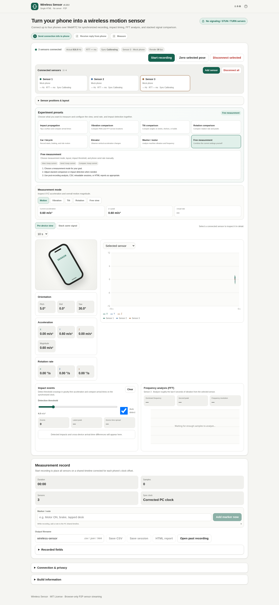

# Wireless Sensor

[](https://github.com/ttomohisa/htmlapps-wireless-sensor/actions/workflows/deploy-pages.yml)
[](LICENSE)
[](https://ttomohisa.github.io/htmlapps-wireless-sensor/)

[日本語版 README](README.ja.md)

A privacy-focused, single-HTML Browser Kitty tool that connects up to four smartphones as wireless motion sensors, synchronizes them over WebRTC, and keeps complete measurement sessions local. It includes guided experiments, cross-device impact timing, FFT analysis, polished camera-first QR pairing, power/load controls for long sessions, markers, sensor positions, reloadable session files, and standalone HTML reports.

## 🚀 Live demo

### [Open Wireless Sensor on GitHub Pages](https://ttomohisa.github.io/htmlapps-wireless-sensor/)

Open the same page on a PC/tablet and a smartphone. GitHub Pages only delivers the app HTML; the WebRTC connection metadata is exchanged directly by QR code or copy/paste, and sensor measurements are sent peer-to-peer. No signaling, STUN, or TURN server is used.

[](https://ttomohisa.github.io/htmlapps-wireless-sensor/)

## Features

- **Guided experiment presets** — Choose **Impact propagation / Vibration comparison / Tilt comparison / Rotation comparison / Car or bicycle / Elevator / Washer or motor / Free measurement** to configure the measurement mode, layout, chart window, impact detection, and recommended phone send rate together, with placement and procedure guidance.
- **Measure up to four phones at once** — The receiver keeps an independent WebRTC peer connection per phone, so one disconnected sensor does not stop the others.
- **Use a phone as a wireless motion sensor** — Read acceleration, acceleration including gravity, rotation rate, and device orientation from the browser.
- **Connect without a signaling server** — WebRTC peers are created with `iceServers: []`; offer/answer metadata is handed directly between devices.
- **Camera-first QR handoff in both directions** — The PC shows segmented offer QR pages, the phone scans them, then the PC scans the phone's segmented reply QR pages.
- **Designed for ordinary cameras** — QR payloads are split into lower-density pages, the phone prefers its rear camera, and desktop scanning falls back to embedded `jsQR` when native QR decoding is unavailable.
- **Per-device, overlay, and stacked comparison views** — Keep the original selected-sensor detail view, overlay all connected sensors, or stack the same acceleration/vibration/tilt/rotation signal vertically for each phone.
- **Clock-corrected synchronized recording** — Connection-time and periodic ping/pong bursts estimate each phone’s offset and drift relative to the PC, favoring low-RTT samples. Per-sensor sync uncertainty is shown in the UI.
- **Measurement modes for common tasks** — Switch between **Motion / Vibration / Tilt / Rotation / Free view**. Vibration mode includes rolling 2-second RMS, peak, and range; rotation mode includes combined rotation metrics.
- **Impact detection and arrival-time differences** — Detect threshold crossings in gravity-free acceleration, group the same impact across synchronized phones, and show how many milliseconds later it reached each device.
- **FFT frequency analysis** — Analyze roughly the latest four seconds from the selected phone and show dominant frequency, a secondary peak, and frequency resolution. The axis with the strongest motion is selected automatically.
- **Post-recording analysis** — After recording stops, automatically summarize duration, sensor count, samples, impacts, maximum shock, sync quality, per-sensor vibration metrics, whole-recording FFT, and event-centered zoomed waveforms.
- **Markers and notes** — Add timestamped notes such as “Motor ON”, “Brake”, or “Tapped desk” while recording; they appear in analysis, session files, reports, and CSV near the closest sample.
- **Sensor positioning** — Rename sensors and enter XYZ positions in centimeters. Impact details can then show straight-line distance and an apparent propagation speed between devices.
- **Reloadable measurement sessions** — Save JSON as a Wireless Sensor session and open v4–v8 session files later without reconnecting phones; analysis and reports are rebuilt locally.
- **Standalone HTML reports** — Export a single self-contained report with measurement summary, sensor layout, vibration metrics, FFT results, impacts, timing differences, markers, and compact vibration plots.
- **Polished camera-first pairing** — Choosing the receiver automatically creates an offer QR; choosing the phone-sensor role automatically opens the QR camera. Pairing guidance explains reply transfer, connection checking, transient reconnects, and failures without imposing a user-transfer timeout.
- **Power/load controls for long sessions** — Power saving / Standard / High precision adjust transmission and phone preview refresh. Screen Wake Lock can be disabled, DataChannel backpressure drops stale samples instead of building a queue, and receiver rendering is throttled while raw recording remains unchanged.
- **Single HTML, bilingual UI** — Required QR libraries are embedded at build time; Japanese and English are included in the same app.

## Quick start

### Use the web demo

1. Open [Wireless Sensor](https://ttomohisa.github.io/htmlapps-wireless-sensor/) on both devices.
2. Keep both devices on the same Wi-Fi / LAN.
3. On the PC or tablet, choose **View measurements on this device**. The connection QR is created automatically.
4. On the phone, choose **Use this phone as the sensor**. Its QR camera opens automatically; scan the QR pages shown on the PC.
5. When the phone shows reply QR pages, press **Scan phone reply QR with camera** on the PC and point the phone screen at the PC camera.
6. After the WebRTC connection opens, press **Start sensor** on the phone and grant motion-sensor permission when requested.
7. To add another phone, press **Add sensor** on the receiver and repeat the same QR pairing flow. Up to four phones can remain connected at once.

No installation or account is required. HTTPS hosting is recommended for phone camera and motion-sensor permissions.

### Build a standalone HTML

1. Download or clone this repository.
2. On Windows 10 / 11, double-click `build-standalone.bat`.
3. The first build downloads the exact dependency versions pinned in `dependencies.json`.
4. Open `dist/index.html`, or copy that single file wherever you need it.

Python, Node.js, and a local web server are not required. The builder uses Windows PowerShell and the built-in `tar.exe`.

## Usage

### Receiver: PC / tablet

1. Choose **View measurements on this device**. The first segmented QR offer is created automatically.
2. Pair one to four phones. **Add sensor** immediately starts a new QR pairing flow while existing sensors stay connected.
3. Open **Sensor positions & layout** to rename devices and optionally enter XYZ positions in centimeters. These positions are stored by sensor slot on the receiver.
4. Choose an **Experiment preset** or configure the **Measurement mode** and comparison layout manually.
5. Use **Impact events**, synchronized stacked charts, and **Frequency analysis (FFT)** while measuring.
6. Start recording. The receiver records all connected sensors on the clock-corrected shared timeline.
7. During recording, type a note and press **Add marker now** whenever something meaningful happens.
8. Stop recording to open **Measurement results**, including per-sensor vibration metrics, impact timing, event-centered waveforms, markers, and whole-recording FFT.
9. Save **CSV**, a reloadable **session JSON**, or a self-contained **HTML report**.
10. Use **Open past recording** to reload a saved Wireless Sensor session later and rebuild its analysis without reconnecting the phones.

### Sensor: phone

1. Choose **Use this phone as the sensor**. The QR camera opens automatically.
2. Press **Scan PC QR with camera** only when you want to restart scanning. The rear camera is preferred when available.
3. Fill the guide with the QR code. Multiple pages are collected automatically in any order.
4. When all pages are captured, the offer is restored and reply QR pages are generated locally.
5. Show those reply QR pages to the PC camera.
6. After connecting, press **Start sensor** and allow sensor access.
7. Choose **Power saving**, **Standard**, or **High precision**. These are transmission throttling targets, not guaranteed hardware sampling rates; Power saving also reduces phone preview refresh.
8. Toggle **Keep screen awake while measuring** as needed. Turning it off saves battery, but some browsers stop sensor events after the display sleeps.

Copy/paste connection codes remain available as a fallback if either camera cannot scan QR codes.

## Sensor data

Wireless Sensor uses the browser `devicemotion` and `deviceorientation` events. Recorded data includes:

- acceleration x / y / z
- derived acceleration magnitude `√(x² + y² + z²)`
- acceleration including gravity x / y / z
- rotation rate alpha / beta / gamma
- orientation alpha / beta / gamma
- orientation absolute flag
- browser-reported `DeviceMotionEvent.interval`
- sensor ID / sensor name / device label
- clock-synchronized shared elapsed time for cross-device comparison
- receive-time elapsed value as a diagnostic/fallback
- estimated sync uncertainty, clock offset, and clock drift
- experiment preset, measurement mode, vibration value, and combined rotation magnitude
- optional sensor XYZ position in centimeters
- recording markers/notes (stored in session JSON; CSV attaches them to the closest sample row)
- per-sensor elapsed time, sensor timestamp, and receive timestamp
- sequence number

Session JSON v8 also stores sensor layout, impact events, marker notes, synchronization metadata, and the full sample timeline so the session can be reopened later.

Unavailable browser/device values are stored as empty CSV fields or `null` in JSON.

## Publish with GitHub Pages

The repository includes a workflow that builds the embedded standalone HTML and deploys `dist/` to GitHub Pages.

1. Push the repository to GitHub as `htmlapps-wireless-sensor`.
2. Open **Settings → Pages → Build and deployment → Source** and select **GitHub Actions**.
3. Push to `main`, or manually run **Deploy standalone app to GitHub Pages** from the Actions tab.
4. After a successful deployment, the app is available at `https://ttomohisa.github.io/htmlapps-wireless-sensor/`.

Each push to `main` rebuilds the app from pinned dependencies, verifies the generated standalone HTML, and then publishes it. The workflow skips deployment with guidance if GitHub Pages has not been enabled yet.

## Development and build layout

```text
.
├─ src/index.template.html       # Application template
├─ app.config.json               # App metadata and version
├─ dependencies.json             # Pinned embedded dependencies
├─ build-standalone.bat          # Windows build entry point
├─ build-standalone.ps1          # Standalone HTML builder
├─ scripts/                      # Repository/build verification
├─ assets/                       # Favicon and README screenshots
├─ dist/                         # Generated deployment artifacts
└─ .github/workflows/
   ├─ build-standalone.yml       # Pull request build validation
   └─ deploy-pages.yml           # Automatic Pages deployment from main
```

### Build and verify

```powershell
.\build-standalone.bat
pwsh -File .\scripts\check-repository.ps1
```

The build process automatically:

- downloads exact npm package versions from `dependencies.json`
- embeds `qrcode-generator` and gzip-compressed `jsQR` into the HTML
- records dependency hashes and build metadata
- rejects unresolved build placeholders
- verifies the runtime network-blocking policy
- produces readable and self-extracting standalone HTML artifacts

Do not edit generated files under `dist/` manually.

## Privacy and runtime network protection

Wireless Sensor deliberately uses no signaling, STUN, or TURN infrastructure.

- WebRTC peers are created with `RTCPeerConnection({ iceServers: [] })`.
- Offer/answer metadata is transferred directly by QR code or copy/paste.
- Sensor measurements travel directly to the connected peer over WebRTC DataChannel.
- Measurements stay in receiver memory until the user explicitly saves CSV, a session JSON, or an HTML report.
- The generated HTML keeps a Content Security Policy with `connect-src 'none'` for normal runtime network APIs.
- The QR generator and decoder are embedded; there is no runtime CDN.

The GitHub Pages version still needs the initial HTML request. For a completely disconnected copy, build and open `dist/index.html`; note that browser camera/sensor permissions can be more restrictive for `file://` pages, so manual connection-code transfer may be required.

## Limitations

- **Same-LAN use is the primary target.** Without STUN/TURN, connections across different networks or NATs are intentionally out of scope.
- Company, school, guest Wi-Fi, VPNs, firewalls, or access points with client isolation can block device-to-device traffic even when both devices appear to be on the same Wi-Fi.
- Browser sensor values are not a substitute for calibrated scientific instruments. Accuracy, available fields, and sample rates vary by device, OS, and browser.
- iPhone/iPad and some browsers require an explicit permission gesture for motion sensors.
- Backgrounding or locking the phone can suspend browser sensor events and stop streaming. This is especially important when screen Wake Lock is disabled for power saving.
- Long recordings remain in receiver memory until saved. Multi-phone sessions accumulate samples faster, so save in segments when needed. Reloading a large saved session also uses receiver memory.
- Clock synchronization is an NTP-like estimate over the WebRTC DataChannel. It favors low-RTT samples and corrects offset and long-run drift, but cannot guarantee asymmetric network delay or OS/browser timer behavior. It is not a replacement for PTP/GNSS-grade scientific synchronization.
- v0.19.0 supports up to four simultaneous phones. GPS, magnetometer, microphone sensing, and camera sensing beyond QR setup remain out of scope.
- Impact timing is a browser-level threshold detector. Sampling frequency, threshold, device mounting, and sensor quality affect the detected arrival time.
- FFT bandwidth is limited by the measured sensor sample rate. Around 30 Hz sampling, useful analysis is limited to roughly 15 Hz and below.

## Dependencies

| Library | Version | License | Purpose |
| --- | ---: | --- | --- |
| qrcode-generator | 1.4.4 | MIT | Generate segmented offer/answer QR codes |
| jsQR | 1.4.0 | Apache-2.0 | Offline QR decoding fallback, especially on desktop |

See [THIRD_PARTY_NOTICES.md](THIRD_PARTY_NOTICES.md) for details.

## Contributing

Bug reports and feature proposals are welcome through GitHub Issues. See [CONTRIBUTING.md](CONTRIBUTING.md) for development guidance.

## License

Copyright © 2026 ttomohisa

Licensed under the [MIT License](LICENSE).
